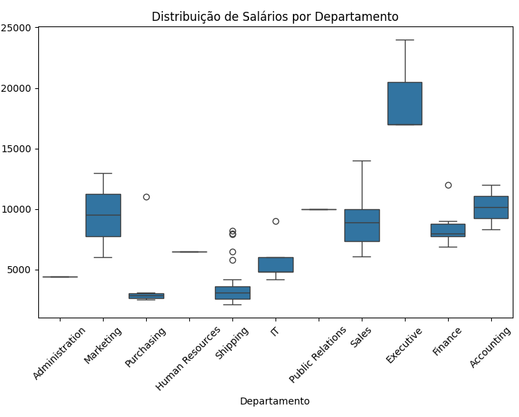

# Projeto: Visualização de Dados e Business Intelligence - RH

**Aluno:** Pietro Veloso Rosa 
**Turma:** QA VDBI 2026/1 2 

## Objetivo do Trabalho
Este projeto atua como uma análise de dados para o setor de Recursos Humanos (RH) de uma empresa fictícia. O objetivo principal é entender a distribuição salarial da empresa, analisando a relação entre cargos e departamentos, além de identificar padrões de remuneração considerando a distribuição geográfica (cidade, estado e país) dos colaboradores.

## Tabelas Usadas
Os dados foram extraídos do banco de dados relacional FreeSQL, utilizando o esquema **Human Resources (HR)**. As tabelas utilizadas foram:
* **EMPLOYEES:** Contém os dados dos funcionários (nome, salário, IDs de referência).
* **DEPARTMENTS:** Contém os setores da empresa.
* **JOBS:** Contém as informações dos cargos e faixas salariais.
* **LOCATIONS:** Contém os endereços (cidade, estado).
* **COUNTRIES:** Contém os países onde a empresa atua.
* **REGIONS:** Contém as regiões globais (ex: Américas, Europa).

## Resumo das Consultas SQL
Para extrair as informações necessárias, foram desenvolvidas duas consultas (queries) principais exportadas para arquivos `.csv`:

1. **Query 1 - Salários por Departamento e Cargo:** Relacionou a tabela de funcionários com departamentos e cargos através de cláusulas `LEFT JOIN`, aplicando um filtro `WHERE` para capturar salários válidos. O resultado foi exportado para `query_01.csv`.
2. **Query 2 - Funcionários por Região:** Cruzou os dados de funcionários com departamentos, localizações, países e regiões, utilizando múltiplos `LEFT JOIN` e um filtro `WHERE` para remover regiões nulas. O resultado foi exportado para `query_02.csv`.

## Análise Feita em Python
A etapa de Análise Exploratória de Dados (EDA) foi desenvolvida em Python. O script `analise_exploratoria.py` utiliza a biblioteca `pandas` para ler os arquivos CSV e calcular métricas de estatística descritiva, como:
* Média salarial
* Mediana salarial
* Valor mínimo e máximo dos salários

Além disso, as bibliotecas `matplotlib` e `seaborn` foram utilizadas para a geração de um **Boxplot**, permitindo a visualização da distribuição de salários por departamento e a identificação de possíveis *outliers* (valores fora do padrão).

## Principais Resultados Encontrados
A partir da Análise Exploratória de Dados (EDA) e da leitura do Boxplot, identificamos os seguintes padrões de negócio:O Topo da Hierarquia:
* O departamento Executive possui a maior faixa salarial da empresa. O menor salário deste setor ainda é superior ao salário máximo de quase todos os outros departamentos, sendo o principal responsável por elevar a média salarial global da empresa.
* Maior Variação Interna: O departamento de Sales (Vendas) apresenta a maior amplitude salarial (a "caixa" mais alta no gráfico). Isso indica uma forte diferença de níveis hierárquicos internos (ex: júnior, pleno, sênior) ou forte impacto de remuneração variável/comissões.
* A Base Operacional: Os setores Purchasing e Shipping concentram os menores salários (entre 2.500 e 3.000) e possuem pouquíssima variação de pagamento entre os colaboradores.
* Relevância dos Outliers: O gráfico revelou pontos fora do padrão (outliers) muito acima da média em setores como Shipping, Finance e IT. Para o RH, esses pontos são altamente relevantes, pois indicam possíveis cargos de liderança ou especialistas que ganham significativamente mais que a base de suas equipes.
* Anomalia de Dados: Departamentos como Administration e Public Relations não apresentam variação no gráfico (são apenas uma linha reta). Isso sugere que há apenas um funcionário registrado nesses setores na base de dados, ou que todos recebem exatamente o mesmo valor.

### Visualização Gráfica (Boxplot)

## Como Executar o Projeto
1. Clone este repositório na sua máquina local.
2. Certifique-se de ter o Python instalado, além das bibliotecas `pandas`, `matplotlib` e `seaborn` (instale-as via terminal com `pip install pandas matplotlib seaborn`).
3. Abra a pasta do projeto no VS Code ou terminal.
4. Execute o script Python utilizando o comando: `python analise_exploratoria.py`.
5. O terminal exibirá as estatísticas descritivas e uma janela abrirá mostrando o gráfico gerado.

## Sugestões de Melhoria
*(Preencha com ideias para o futuro)*
* **Melhoria 1:** Criar um painel interativo (Dashboard) para o RH monitorar essas métricas em tempo real.
* **Melhoria 2:** Adicionar uma análise preditiva para estimar o salário adequado de um novo colaborador com base em sua região e cargo.